# TextClassification-Keras

This code repository implements a variety of **deep learning models** for **text classification** using the **Keras** framework, which includes: **FastText**, **TextCNN**, **TextRNN**, **TextBiRNN**, **TextAttBiRNN**, **HAN**, **RCNN**, **RCNNVariant**, etc. In addition to the model implementation, a simplified application is included.

- [English documents](README.md)
- [中文文档](README-ZH.md)

## Guidance

1. [Environment](#environment)
2. [Usage](#usage)
3. [Model](#model)
    1. [FastText](#1-fasttext)
    2. [TextCNN](#2-textcnn)
    3. [TextRNN](#3-textrnn)
    4. [TextBiRNN](#4-textbirnn)
    5. [TextAttBiRNN](#5-textattbirnn)
    6. [HAN](#6-han)
    7. [RCNN](#7-rcnn)
    8. [RCNNVariant](#8-rcnnvariant)
    999. [To Be Continued...](#to-be-continued)
4. [Reference](#reference)

## Environment

- Python 3.6
- NumPy 1.15.2
- Keras 2.2.0
- Tensorflow 1.8.0

## Usage

All codes are located in the directory ```/model```, and each kind of model has a corresponding directory in which the model and application are placed.

For example, the model and application of FastText are located under ```/model/FastText```, the model part is ```fast_text.py```, and the application part is ```main.py```.

## Model

### 1 FastText

FastText was proposed in the paper [Bag of Tricks for Efficient Text Classification](https://arxiv.org/pdf/1607.01759.pdf).

#### 1.1 Description in Paper

<p align="center">
	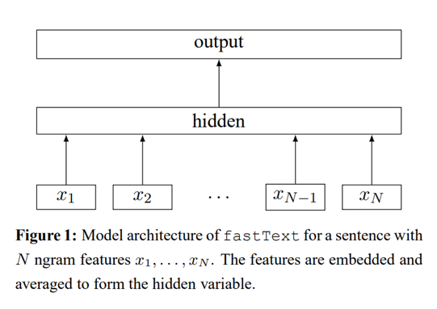
</p>

1.	Using a look-up table, **bags of ngram** covert to **word representations**.
2.	Word representations are **averaged** into a text representation, which is a hidden variable.
3.	Text representation is in turn fed to a **linear classifier**.
4.	Use the **softmax** function to compute the probability distribution over the predefined classes.

#### 1.2 Implementation Here

Network structure of FastText:

<p align="center">
	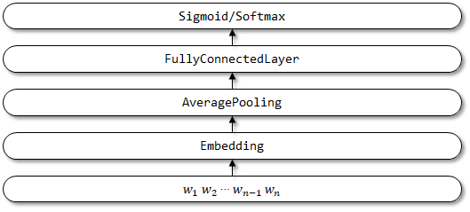
</p>

### 2 TextCNN

TextCNN was proposed in the paper [Convolutional Neural Networks for Sentence Classification](http://www.aclweb.org/anthology/D14-1181).

#### 2.1 Description in Paper

<p align="center">
	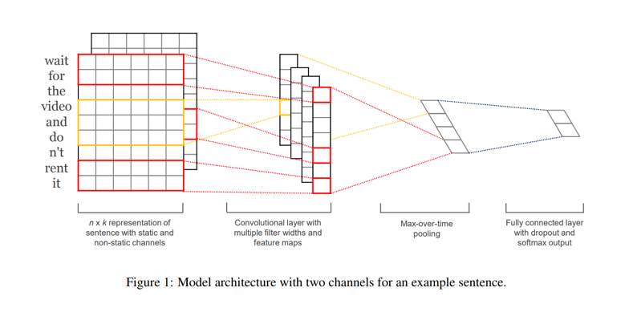
</p>

1. Represent sentence with **static and non-static channels**.
2. **Convolve** with multiple filter widths and feature maps.
3. Use **max-over-time pooling**.
4. Use **fully connected layer** with **dropout** and **softmax** ouput.

#### 2.2 Implementation Here

Network structure of TextCNN:

<p align="center">
	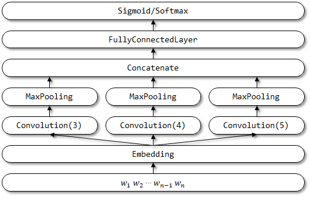
</p>

### 3 TextRNN

TextRNN has been mentioned in the paper [Recurrent Neural Network for Text Classification with Multi-Task Learning](https://www.ijcai.org/Proceedings/16/Papers/408.pdf).

#### 3.1 Description in Paper

<p align="center">
	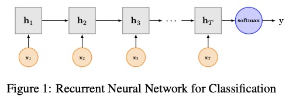
</p>

#### 3.2 Implementation Here

Network structure of TextRNN:

<p align="center">
	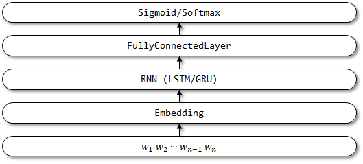
</p>

### 4 TextBiRNN

TextBiRNN is an improved model based on TextRNN. It improves the RNN layer in the network structure into a bidirectional RNN layer. It is hoped that not only the forward encoding information but also the reverse encoding information can be considered. No related papers have been found yet.

Network structure of TextBiRNN:

<p align="center">
	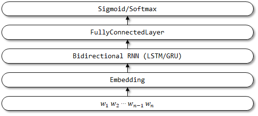
</p>

### 5 TextAttBiRNN

TextAttBiRNN is an improved model which introduces attention mechanism based on TextBiRNN. For the representation vectors obtained by bidirectional RNN encoder, the model can focus on the information most relevant to decision making through the attention mechanism. The attention mechanism was first proposed in the paper [Neural Machine Translation by Jointly Learning to Align and Translate](https://arxiv.org/pdf/1409.0473.pdf), and the implementation of the attention mechanism here is referred to this paper [Feed-Forward Networks with Attention Can Solve Some Long-Term Memory Problems](https://arxiv.org/pdf/1512.08756.pdf).

#### 5.1 Description in Paper

<p align="center">
	
</p>

In the paper [Feed-Forward Networks with Attention Can Solve Some Long-Term Memory Problems](https://arxiv.org/pdf/1512.08756.pdf), the **feed forward attention** is simplified as follows,

<p align="center">
	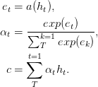
</p>

Function `a`, a learnable function, is recognized as a **feed forward network**. In this formulation, attention can be seen as producing a fixed-length embedding `c` of the input sequence by computing an **adaptive weighted average** of the state sequence `h`.

#### 5.2 Implementation Here

The implementation of attention is not described here, please refer to the source code directly.

Network structure of TextAttBiRNN:

<p align="center">
	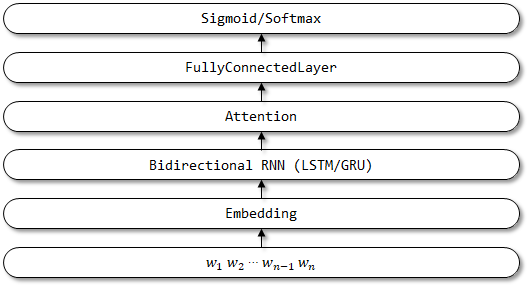
</p>

### 6 HAN

HAN was proposed in the paper [Hierarchical Attention Networks for Document Classification](http://www.aclweb.org/anthology/N16-1174).

#### 6.1 Description in Paper

<p align="center">
	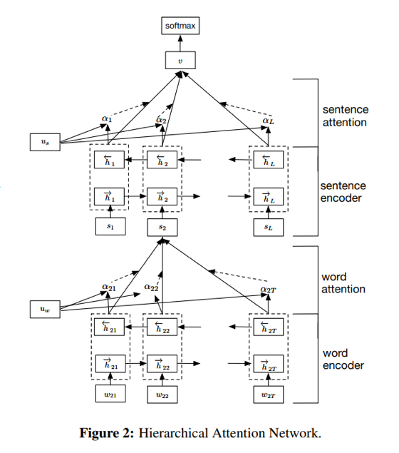
</p>

1. **Word Encoder**. Encoding by **bidirectional GRU**, an annotation for a given word is obtained by concatenating the forward hidden state and backward hidden state, which summarizes the information of the whole sentence centered around word in current time step.
2. **Word Attention**. By a one-layer **MLP** and softmax function, it is enable to calculate normalized importance weights over the previous word annotations. Then, compute the sentence vector as a **weighted sum** of the word annotations based on the weights.
3. **Sentence Encoder**. In a similar way with word encoder, use a **bidirectional GRU** to encode the sentences to get an annotation for a sentence.
4. **Sentence Attention**. Similar with word attention, use a one-layer **MLP** and softmax function to get the weights over sentence annotations. Then, calculate a **weighted sum** of the sentence annotations based on the weights to get the document vector.
5. **Document Classification**. Use the **softmax** function to calculate the probability of all classes.

#### 6.2 Implementation Here

The implementation of attention here is based on FeedForwardAttention, which is the same as the attention in TextAttBiRNN.

Network structure of HAN:

<p align="center">
	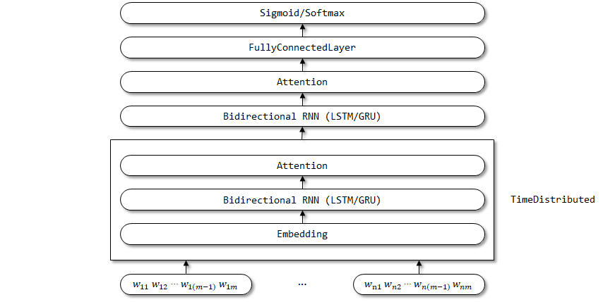
</p>

The TimeDistributed wrapper is used here, since the parameters of the Embedding, Bidirectional RNN, and Attention layers are expected to be shared on the time step dimension.

### 7 RCNN

RCNN was proposed in the paper [Recurrent Convolutional Neural Networks for Text Classification](https://www.aaai.org/ocs/index.php/AAAI/AAAI15/paper/view/9745/9552).

#### 7.1 Description in Paper

<p align="center">
	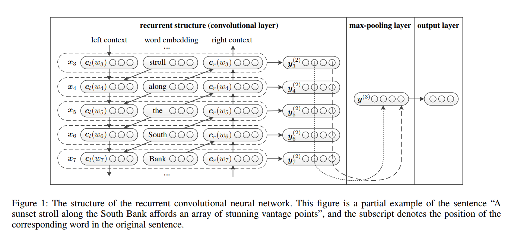
</p>

1. **Word Representation Learning**. RCNN uses a recurrent structure, which is a **bi-directional recurrent neural network**, to capture the contexts. Then, combine the word and its context to present the word. And apply a **linear transformation** together with the `tanh` activation fucntion to the representation.
2. **Text Representation Learning**. When all of the representations of words are calculated, it applys a element-wise **max-pooling** layer in order to capture the most important information throughout the entire text. Finally, do the **linear transformation** and apply the **softmax** function.

#### 7.2 Implementation Here

Network structure of RCNN:

<p align="center">
	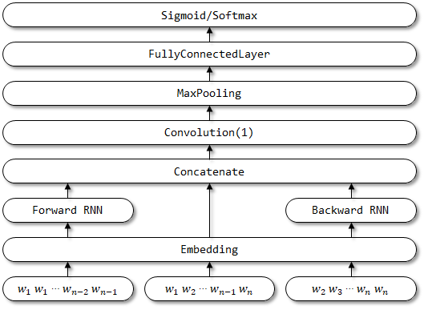
</p>

### 8 RCNNVariant

RCNNVariant is an improved model based on RCNN with the following improvements. No related papers have been found yet.

1. The three inputs are changed to **single input**. The input of the left and right contexts is removed.
2. Use **bidirectional LSTM/GRU** instead of traditional RNN for encoding context.
3. Use **multi-channel CNN** to represent the semantic vectors. 
4. Replace the Tanh activation layer with the **ReLU activation layer**.
5. Use both **AveragePooling** and **MaxPooling**.

Network structure of RCNNVariant:

<p align="center">
	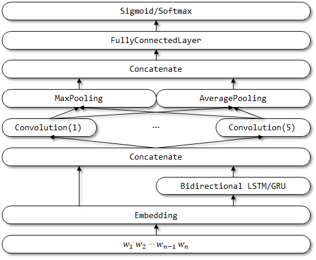
</p>

### To Be Continued...

## Reference

1. [Bag of Tricks for Efficient Text Classification](https://arxiv.org/pdf/1607.01759.pdf)
2. [Keras Example IMDB FastText](https://github.com/keras-team/keras/blob/master/examples/imdb_fasttext.py)
3. [Convolutional Neural Networks for Sentence Classification](http://www.aclweb.org/anthology/D14-1181)
4. [Keras Example IMDB CNN](https://github.com/keras-team/keras/blob/master/examples/imdb_cnn.py)
5. [Recurrent Neural Network for Text Classification with Multi-Task Learning](https://www.ijcai.org/Proceedings/16/Papers/408.pdf)
6. [Neural Machine Translation by Jointly Learning to Align and Translate](https://arxiv.org/pdf/1409.0473.pdf)
7. [Feed-Forward Networks with Attention Can Solve Some Long-Term Memory Problems](https://arxiv.org/pdf/1512.08756.pdf)
8. [cbaziotis's Attention](https://gist.github.com/cbaziotis/6428df359af27d58078ca5ed9792bd6d)
9. [Hierarchical Attention Networks for Document Classification](http://www.aclweb.org/anthology/N16-1174)
10. [Richard's HAN](https://richliao.github.io/supervised/classification/2016/12/26/textclassifier-HATN/)
11. [Recurrent Convolutional Neural Networks for Text Classification](https://www.aaai.org/ocs/index.php/AAAI/AAAI15/paper/view/9745/9552)
12. [airalcorn2's RCNN](https://github.com/airalcorn2/Recurrent-Convolutional-Neural-Network-Text-Classifier)